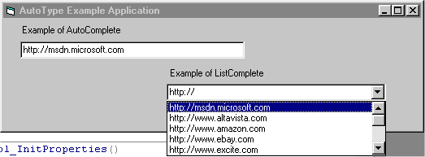



## AutoType/AutoComplete ActiveX Control \- Update: IE 5 Style

### Description

It's a text box (or combobox) that will complete your typing for you, or popup a list as you type so that it doesn't annoy you while your typing. Includes standard text box events. Acts just like Internet Explorer's address bar! UPDATE: Popup List with matching items! URL Aware! Local FileSystem Path Lookup! Just like IE 5!! If your mother only knew!!
 
### More Info
 

             |
---                |---
**Submitted On**   |2001-08-03 14:26:58
**By**             |[Nickels](https://github.com/Planet-Source-Code/PSCIndex/blob/master/ByAuthor/nickels.md)
**Level**          |Advanced
**User Rating**    |4.8 (19 globes from 4 users)
**Compatibility**  |VB 5\.0, VB 6\.0
**Category**       |[Custom Controls/ Forms/  Menus](https://github.com/Planet-Source-Code/PSCIndex/blob/master/ByCategory/custom-controls-forms-menus__1-4.md)
**World**          |[Visual Basic](https://github.com/Planet-Source-Code/PSCIndex/blob/master/ByWorld/visual-basic.md)
**Archive File**   |[AutoType\_A24030832001\.zip](https://github.com/Planet-Source-Code/nickels-autotype-autocomplete-activex-control-update-ie-5-style__1-25780/archive/master.zip)

